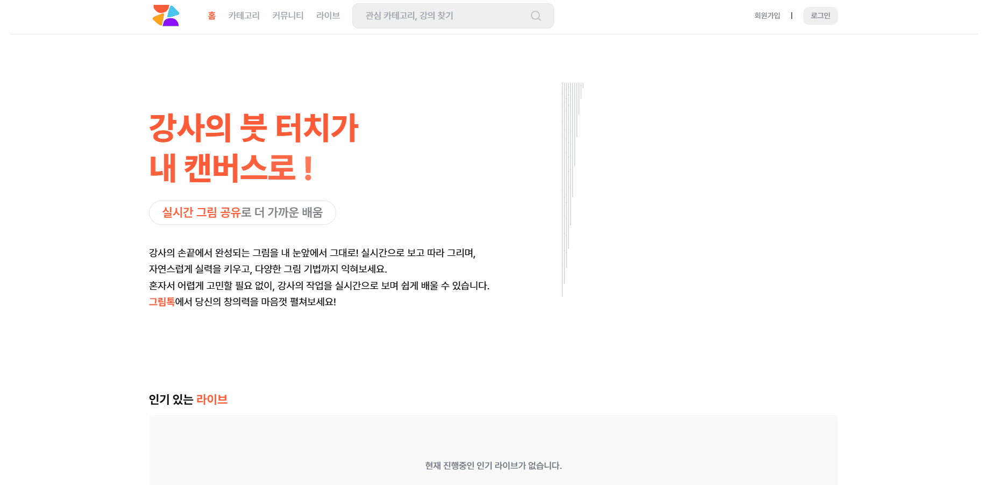
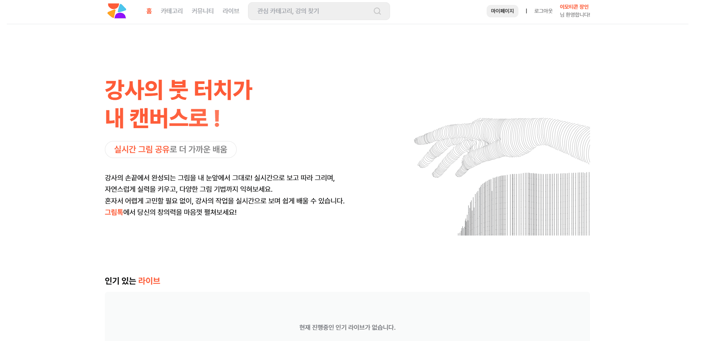
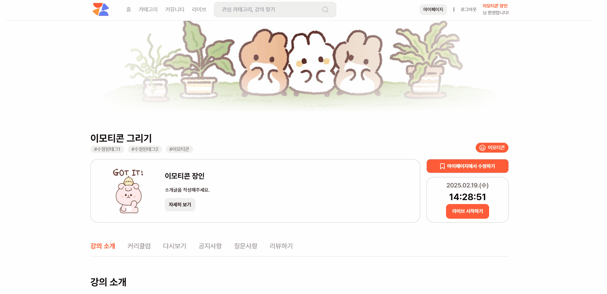
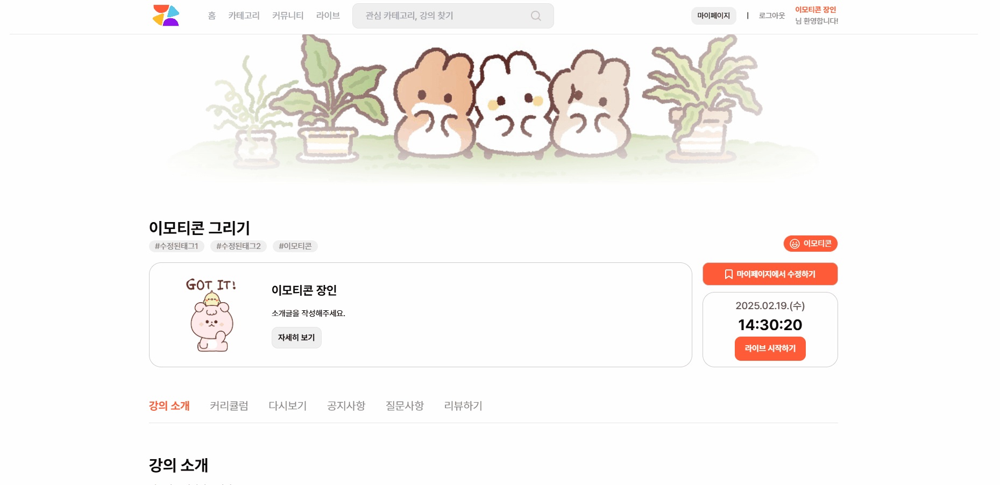
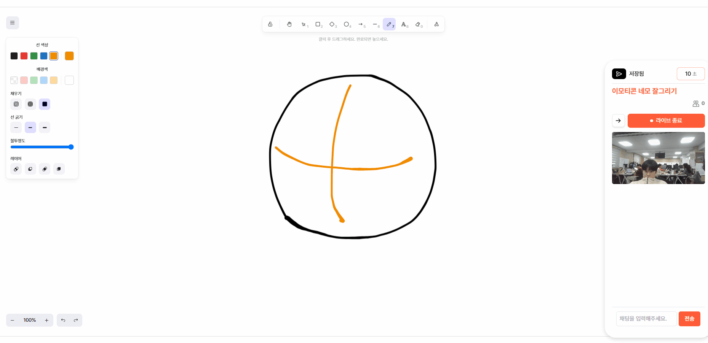
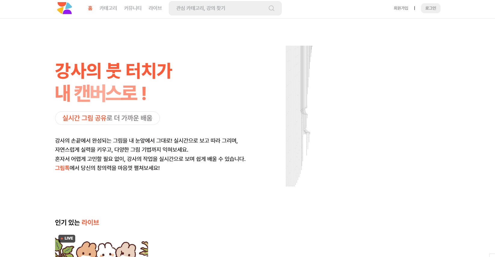
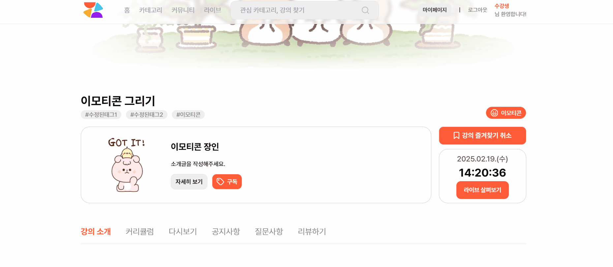
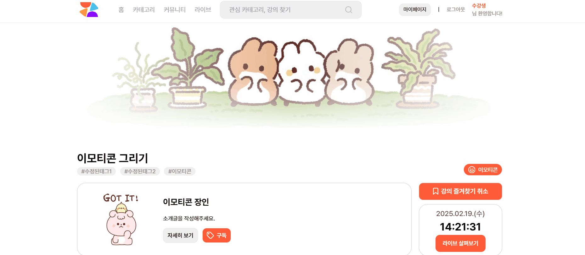

# 🎨 그림톡

> **라이브로 배우고, 누구나 강사가 되는 그림 플랫폼!**  
> 실시간 소통 기반 미술 교육 플랫폼

---

## 📑 목차
1. [📋 프로젝트 소개](#-프로젝트-소개)
2. [🚀 주요 기능](#-주요-기능)
3. [🛠️ 기술 스택](#-기술-스택)
4. [📂 프로젝트 구조](#-프로젝트-구조)
5. [⚙️ 설치 및 실행 방법](#-설치-및-실행-방법)
6. [👨‍👩‍👧‍👦 팀원 정보](#-팀원-정보)
7. [📌 기타 정보](#-기타-정보)

---

## 📋 프로젝트 소개
> **실시간 소통 기반 미술 교육 플랫폼**

- 실시간 스트리밍과 그림 툴을 활용하여 강사와 수강생 간의 쌍방향 미술 교육 제공
- AI 기반의 그림 유사도 측정을 통해 효율적인 피드백 가능

---

## 🚀 주요 기능
1. **실시간 스트리밍 서비스**
2. **실시간 그림 툴 제공**
   - 스트리밍 화질 문제 해결
   - 그림 데이터를 소켓으로 전송해 실시간 반영
   - 강사의 그림에 투명도를 적용하여 쉽게 따라 그릴 수 있는 기능
3. **AI 그림 유사도 측정**
4. **대시보드 기능**
   - 본인의 학습 현황 및 진행 상황 조회
5. **커리큘럼 기반 강의 생성 및 수강**
6. **라이브 다시보기**
   - 녹화본뿐만 아니라 그림 툴까지 제공
   - 타임라인 기능으로 편리한 탐색 가능

---

## 🛠️ 기술 스택

### 💻 프론트엔드


### ⚙️ 백엔드


### 🗄️ 데이터베이스


### ☁️ 인프라


### 협업 툴


### IDE & 편집툴


---

## 📂 프로젝트 구조

### 📦 프론트엔드
```bash
src/
├── api/            # API 관련 로직
│   └── instance.js # axios 인스턴스 설정
├── assets/         # 이미지, 폰트 등 정적 파일
│   └── images/     # 이미지
│   └── lottie/     # lottie 관련 json
├── components/     # 재사용 가능한 컴포넌트
│   ├── common/     # 공통 컴포넌트 (Button, Input 등)
│   └── layout/     # 레이아웃 관련 컴포넌트 (Header, Footer 등)
│       └── icons.jsx      # 아이콘 컴포넌트
├── hooks/          # 커스텀 훅
├── layouts/        # 레이아웃 컴포넌트
├── lib/            # 외부 라이브러리 관련 유틸
├── routes/         # 라우트 설정
│   ├── pages/      # 페이지 컴포넌트
│   └── index.jsx   # 라우트 설정
├── store/          # 상태 관리 (Zustand)
├── styles/         # 전역 스타일
│   └── global.css
└── utils/          # 유틸리티 함수
```

### 🖥️ 백엔드
1. Spring Boot
```bash
src/
├── aspects/          # AOP 설정 (로깅)
├── config/           # 애플리케이션 설정 파일
│   ├── cookie/       # 쿠키 관련 설정 및 관리
│   └── jwt/          # JWT 인증 및 보안 설정
├── controller/       # REST API 요청을 처리하는 컨트롤러
│   ├── common/       # API Response 커스텀
│   ├── request/      # 요청(Request) DTO 관리
│   ├── response/     # 응답(Response) DTO 관리
│   └── stomp/        # WebSocket(STOMP) 관련 컨트롤러
├── exception/        # 전역 예외 처리 및 커스텀 예외 정의
├── handler/          # 예외 및 에러 처리 핸들러
├── model/            # 비즈니스 로직과 관련된 데이터 모델
│   ├── dto/          # 데이터 전송 객체(DTO)
│   ├── entity/       # JPA 엔티티 클래스 (DB 테이블 매핑)
│   └── repository/   # 데이터베이스 CRUD를 위한 Repository 인터페이스
└── service/          # 비즈니스 로직을 처리하는 서비스 계층
```
2. FastAPI
```bash
src
├─api                 # REST API 요청을 처리하는 라우터
├─common              # 데이터 전송 객체(DTO)
└─exception           # 전역 예외 처리 및 커스텀 예외 정의
```
3. SocketServer
```bash
src
├── config            # 애플리케이션 설정 파일
├── controller        # REST API 요청을 처리하는 컨트롤러
├── dto               # 데이터 전송 객체(DTO)
└── service           # 비즈니스 로직을 처리하는 서비스 계층
```
### 🏗️ 아키텍처


### 📚 ERD


---

## ⚙️ 설치 및 실행 방법
-> 다시 수정할 예정
### 1️⃣ 로컬 개발 환경 설정
```bash

```

### 2️⃣ 서버 배포 (Docker & Jenkins)
```bash

```

---

## 👨‍👩‍👧‍👦 팀원 정보

| 🧑‍💻 **이름**    | 🏆 **역할**        | 🚀 **이메일주소**        |
|:----------------:|:-----------------:|:-----------------------:|
| **전승기**       | 팀장, 인프라 담당 | moda2047@naver.com     |
| **류재문**       | 백엔드 개발자     |  |
| **권상웅**       | 백엔드 개발자     |  |
| **우정훈**       | 부팀장, 프론트엔드 | hoonixox@naver.com |
| **우준규**       | 프론트엔드, 디자이너 |  |
| **임재열**       | 프론트엔드 개발자  | a01092201761@gmail.com |

## 🛠 담당 파트  

### 전승기  
- **인프라 구축**  
  - AWS EC2, Docker, Jenkins를 활용한 CI/CD 파이프라인 구축  
  - Nginx를 이용한 트래픽 관리(로드밸런싱) 및 리버스 프록시 설정   
  - Docker compose를 통해서 docker 컨테이너 한 번에 관리
  - nGrinder로 부하테스트
- **PM**
  - 전체 일정 관리 및 파트 분배 / QA 담당

### 류재문  
- **백엔드 개발**  
  - 라이브 기능(캠송출, 채팅)을 위한 Openvidu v3 구축
  - 그림데이터(json) 교환을 위한 STOMP 웹소켓 서버 구축
  - 강사/학생 그림 정확도 체크(색상, 엣지, 구조)모델 개발
    - 색상 - OpenCV의 cv2.calcHist
    - 엣지 - Canny 알고리즘
    - 구조 - SSIM 알고리즘
  - 보다 풍부한 피드백을 위해 GPT API 연결
  - 강사의 이미지 정보와 실시간 방인원 체크를 위한 redis 구축
  - 라이브 관련(방입장, 방나가기, 방인원조회, 그림데이터 전송) API 개발
### 권상웅  
- **백엔드 개발**  
  - SSE를 활용한 라이브 시작/종료 알림 기능 구현
  - 회원 기능 및 REST API CRUD 개발
  - RDS, DynamoDB, S3 인프라 구축
### 우정훈  
- **프론트엔드 개발**
  - Excalidraw <-> Stomp 연동을 통해 실시간 그림 공유 및 수정 기능 구현
  - OpenVidu 3 버전 커스터마이징을 통해 영상 송출 및 회의 환경 최적화
  - SSE 알람 연동을 통한 실시간 알림 기능 구현
  - 팀 전체 Git 흐름 및 프론트엔드 코드 품질 관리
  - Prettier와 ESLint 설정을 통해 코드 스타일 일관성 유지 및 자동화
  - Mattermost와 GitLab 연동을 통한 실시간 커뮤니케이션 및 코드 관리 연계
  - Jira와 GitLab 연동으로 프로젝트 관리 및 작업 흐름 최적화

### 우준규  
- **프론트엔드 개발**  
  - Excalidraw 기반 실시간 화이트보드 전달 시스템 구축 및 Stomp 프로토콜을 활용한 데이터 전송 최적화
  - 그림 데이터 전달을 위한 그림 데이터 실시간 동기화 및 실시간 수정 기능 구현
  - 타임스탬프 기반 그림 데이터 저장 시스템 설계로 효율적인 다시보기 기능 구현
  - Tailwind CSS를 활용한 효율적인 UI 개발 및 일관된 디자인 시스템 구축
  - 컴포넌트 기반 UI 설계로 재사용성 높은 디자인 시스템 구현

### 임재열  
- **프론트엔드 개발**  
  - 회원 관리, 강의 생성 및 수강, 대시보드 조회 등 주요 CRUD 기능 구현
  - Axios를 활용한 백엔드 API 연동 및 상태 관리 최적화
  - UI/UX 개선을 위한 최적화 작업 진행 (로딩 속도 개선, 오류 처리 강화)
  - 실시간 데이터 반영을 위한 프론트엔드 상태 관리 보강
  - 다양한 사용자 시나리오를 고려한 예외 처리 및 UX 최적화
- **QA 및 품질 관리**  
  - 프로젝트의 완성도를 높이기 위해 QA 3차까지 직접 수행, 약 100개 이상의 테스트 진행
  - 각종 기능 및 시나리오별 버그 리포트 및 수정 작업 주도
  - 테스트 결과를 기반으로 성능 개선 및 안정성 강화
- **그 외**
  - 팀원 간 원활한 협업을 위해 상세한 회의록 작성 및 문서화

### 공통 파트
- **완성도를 위한 QA -> 3차 QA까지 했으며 약 150개**
- 기획, 요구사항 명세서, ERD구성, API 명세서

---

# 기능 시연
## 강사 시점
### 로그인

### 내 강의 페이지

### 질문 답변

### 라이브 시작

### 라이브 강의

### 다시보기


---
## 수강생 시점
### 로그인

### 강의 조회 & 구독 & 즐겨찾기

### 라이브 입장

### 라이브 기능

### AI 그림 비교

### 다시보기

### 리뷰 작성


---

## 📌 기타 정보
- **CI/CD:** GitLab, Jenkins를 활용한 자동화 배포
- **배포 URL:** [www.grimtalk.com](http://www.grimtalk.com)
- **테스트 방법:** QA 문서 작성 후 페이지별 테스트 진행

